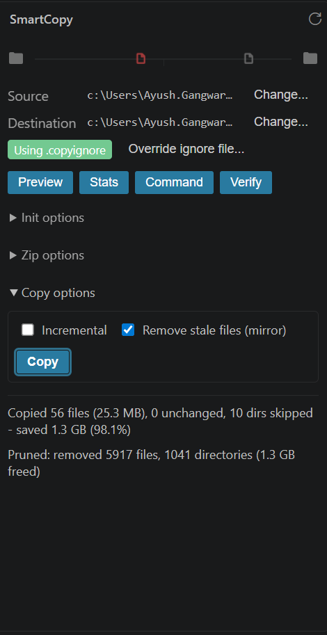

# SmartCopy

### CTRL+A for developers. Copy only source code, never dependencies.

Every developer has done this: `Ctrl+A`, `Ctrl+C` on a project folder to back it up or share it, only to end up copying 8 GB of `node_modules` along with the 200 MB of code that actually matters. SmartCopy fixes that at the root — it understands your project the way `.gitignore` does, and applies that understanding to copying, zipping, verifying, and generating commands, not just version control.

```bash
$ smartcopy preview .
Will Copy
  src/
  package.json
  vite.config.js

Will Skip
  node_modules
  dist

41 files (13.1 MB) will be copied  -  2 skipped (59.4 MB saved, 82.0%)
```

---

## Why this exists

| Tool | Discoverable | Preview before acting | Zero-config | Checksum verify |
|---|---|---|---|---|
| **SmartCopy** | ✅ | ✅ | ✅ (`.gitignore` fallback) | ✅ |
| `robocopy /XD` | ❌ needs memorized flags | ❌ | ❌ | ❌ |
| `rsync --exclude` | ❌ CLI-only, easy to typo | ❌ | ❌ | ❌ (checksums exist but opt-in and manual) |
| `.gitignore` alone | ✅ | ❌ | ✅ | n/a — doesn't copy anything |
| Ad-hoc scripts / manual dedup | ❌ | ❌ | ❌ | ❌ |

`robocopy` and `rsync` are more powerful in raw file-copying terms — SmartCopy doesn't try to out-engineer them. What it does instead is own the parts they don't touch at all: **telling you what will happen before it happens**, **working out of the box with a file you probably already have** (`.gitignore`), and **generating those tools' own commands for you** when you'd rather use them directly.

---

## Install

Not yet published to PyPI. Install from source:

```bash
git clone https://github.com/Aayush-Gangwar/SmartCopy.git
cd SmartCopy
pip install -e .
```

Requires Python ≥ 3.9. Pulls in `typer`, `rich`, and `pyperclip`.

---

## Quick start

```bash
# See what would happen - nothing is touched
smartcopy preview .

# No .copyignore yet? Generate one - auto-detects your project type
smartcopy init                      # writes .copyignore from detected presets
smartcopy init --preset python      # or force a specific one

# Copy source only, skipping everything in .copyignore
smartcopy copy D:\Backup

# Repeat backups fast - skip files unchanged since last time
smartcopy copy D:\Backup --incremental

# copy is merge-only by default: it never deletes anything already in DEST,
# even something that's since been excluded. Add --prune to mirror exactly -
# it lists what it's about to remove and always asks before deleting.
smartcopy copy D:\Backup --prune

# Confirm the backup is actually intact
smartcopy verify D:\Backup
smartcopy verify D:\Backup --diff   # show exactly what differs, if anything does

# Don't want to install smartcopy on the target machine? Generate the
# equivalent robocopy/rsync command and copy it to your clipboard instead
smartcopy command D:\Backup

# Ship a clean, dependency-free zip
smartcopy zip . --output project-clean.zip

# No .copyignore, no setup - just tell me how much bloat is in this project
smartcopy stats .
```

`SRC` is optional everywhere it appears (`copy`, `command`, `verify`) — it defaults to the current directory, so `smartcopy copy D:\Backup` from inside your project works exactly like `smartcopy copy . D:\Backup`.

---

## Commands

| Command | What it does |
|---|---|
| `smartcopy preview [PATH]` | Shows what would be copied vs. skipped, and the bytes saved. Changes nothing. |
| `smartcopy copy [SRC] DEST` | Copies everything not excluded (merges into an existing destination, never deletes by default). `--incremental` skips unchanged files (size+mtime); `--yes` skips the confirmation prompt; `--prune` additionally removes anything in DEST that's no longer in the current source - true mirror, like `robocopy /MIR` - always with its own separate confirmation, since deletion can't be undone. |
| `smartcopy command [SRC] DEST` | Generates a native `robocopy`/`rsync` command from your `.copyignore` and copies it to the clipboard - use it without installing SmartCopy on the target machine. |
| `smartcopy verify [SRC] DEST` | Confirms a copy is byte-for-byte intact via sha256, per file. `--diff` shows a unified diff (or a binary size comparison) for anything that doesn't match. |
| `smartcopy zip [PATH]` | Exports a dependency-free `.zip` of the project. |
| `smartcopy stats [PATH]` | Zero-config bloat report — no `.copyignore` required. Auto-detects your stack and tells you how much of the project is disposable. |
| `smartcopy init [PATH]` | Writes a `.copyignore` from an auto-detected or explicitly chosen preset (`node`, `python`, `java`, `dotnet`, `rust`, `general`). |

`preview`, `copy`, `command`, `verify`, and `zip` all accept `--ignore-file PATH` to point at a specific ignore file instead of the default `.copyignore` → `.gitignore` lookup. `stats` and `init` are zero-config by design and don't take one.

---

## `.copyignore`

```text
# Comments and blank lines are ignored
node_modules/
dist/
*.log

# Negation - re-includes something an earlier rule excluded
!important.log

# Wildcards work like .gitignore
.env.*.local

# A pattern with "/" is anchored to that exact path, not matched by name
# anywhere - only the extension/ project's own node_modules is skipped
extension/node_modules/
```

- **Full gitignore-style matching**: wildcards (`*`, `?`, `[...]`), `!negation` with last-rule-wins semantics, comments, trailing slashes on directories — all supported.
- **Anchored vs. name-only patterns, like real `.gitignore`**: a pattern with no `/` (e.g. `node_modules`) matches that name at any depth in the tree. A pattern containing a `/` (e.g. `extension/node_modules`) is anchored — it only matches that exact relative path, not a same-named folder elsewhere.
- **No `.copyignore` yet?** SmartCopy automatically falls back to your existing `.gitignore`, so most projects work with zero setup.
- **Case rules match the OS**: case-insensitive on Windows, case-sensitive on macOS/Linux — not just "however the pattern happened to be typed."
- **Symlinks and Windows junctions are never followed** — they're detected and skipped outright, so a `pnpm`-style symlinked `node_modules` can't cause an infinite loop or silent duplication.

---

## What makes this different, concretely

- **You see the outcome before it happens.** `preview` and `stats` cost nothing and commit to nothing — no other copy tool in this space shows you a "will copy / will skip" breakdown with a bytes-saved percentage up front.
- **Zero setup for most projects.** The `.gitignore` fallback plus auto-detected presets mean `smartcopy stats .` or `smartcopy init` works the moment you `cd` into almost any real project — no flags to memorize, no file to write by hand first.
- **It doesn't ask you to abandon the tools you already trust.** `smartcopy command` hands you back a real `robocopy`/`rsync` invocation built from the same rules — useful in CI, on a machine without SmartCopy installed, or if you just prefer them.
- **Integrity isn't an afterthought.** `verify --diff` gives you a real sha256-backed guarantee and a line-by-line diff when something doesn't match — most copy tools stop at "it probably worked."
- **Safe by construction.** Symlink/junction-aware scanning, merge-not-clobber destination semantics, and a progress bar on anything that touches real files.
- **Failures don't take down the whole run.** A locked or permission-denied file during `copy`, `verify`, `zip`, or `--prune` is skipped and reported by name with the actual OS error — not a crash, and not silently swallowed. Any such failure also makes the command exit non-zero, so scripts and CI notice.
- **Guards against the obvious footguns.** `copy` refuses to run against a source that doesn't exist, and refuses when the destination is the same as, or nested inside, the source (which would otherwise recursively duplicate itself on repeat runs).

---

## What's next

A VS Code extension already exists — see [`extension/README.md`](extension/README.md) for the sidebar dashboard, cancellable operations, and native diff viewing. PyPI packaging and native Windows Explorer integration are next on the roadmap.

| Copy and Prune | Verify Diff |
|---|---|
|  |  |

## Contributing

```bash
git clone https://github.com/Aayush-Gangwar/SmartCopy.git
cd SmartCopy
pip install -e . pytest
pytest tests -q
```

- Keep the CLI's `--json` output (see `src/smartcopy/jsonio.py`) a stable
  contract — the VS Code extension parses it directly.
- Add a test alongside any behavior change; `pytest tests -q` should stay
  green (76 tests as of this writing).
- Open an issue or PR against `main`; small, focused changes are easiest
  to review.
