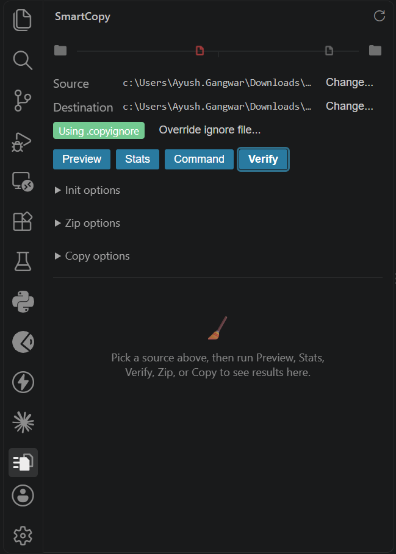
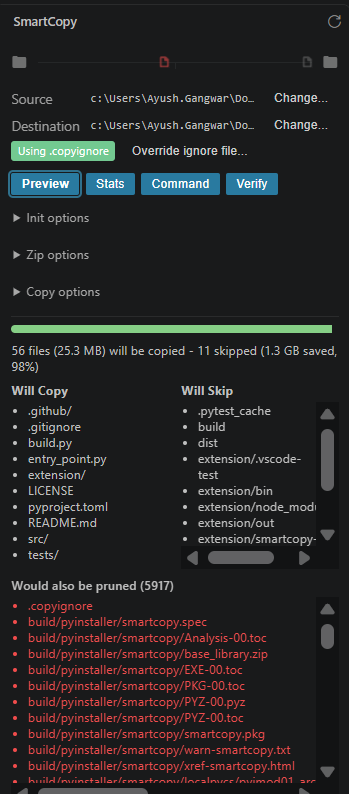
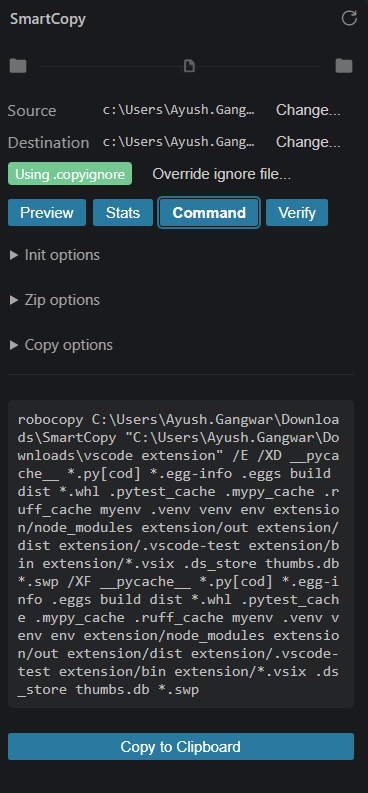

# SmartCopy for VS Code

CTRL+A for developers — copy only source code, never dependencies.

A sidebar dashboard for the SmartCopy CLI: preview, copy,
verify, zip, and generate `robocopy`/`rsync` commands for a project while
skipping `node_modules`, `venv`, `dist`, and anything else in your
`.copyignore` (or `.gitignore` as a fallback) — without leaving VS Code or
needing Python installed.

## Features

- **Dashboard** (Activity Bar → SmartCopy): pick a source/destination,
  then Preview, Copy, Verify, Zip, Stats, or generate a Command — with
  a live progress bar, a bytes-saved meter, and failure reporting.
- **Explorer integration**: right-click any folder → "SmartCopy: Open
  Dashboard for This Folder".
- **Native diff viewing**: click a mismatched file after Verify to open it
  in VS Code's own diff editor.

  

- **Safe mirroring**: the "Remove stale files (mirror)" option always
  shows exactly what would be deleted and asks for confirmation before
  doing it.
- **Cancellable**: a Cancel button appears while any operation runs and
  stops it immediately; inputs are locked while something is in flight so
  a result can never end up describing a source/destination you've since
  changed away from.

## Screenshots

| Preview | Command |
|---|---|
|  |  |

## Requirements

None — this extension bundles a standalone `smartcopy` binary per
platform, so no Python installation is needed.

## License

MIT — see the LICENSE file in this extension's package.
